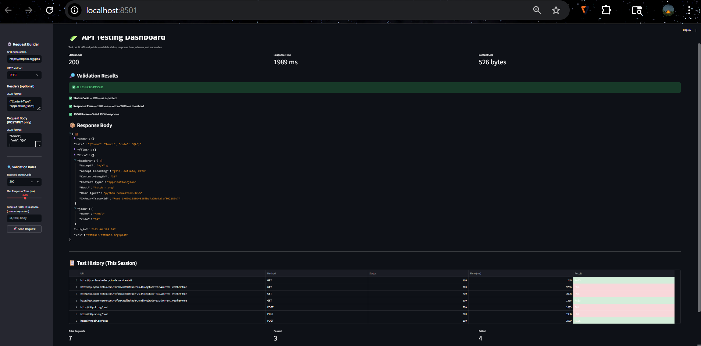

# 🚀 API Testing Dashboard (QA Tool)

A lightweight API Testing Dashboard built using Streamlit to simulate real-world Software Quality Assurance workflows. This tool allows users to send API requests, validate responses, and analyze performance.

---

## 📸 Dashboard Preview



---

## 🔍 Features

* Send **GET** and **POST** requests to any API
* Add custom **headers** and **request body**
* Validate **status codes** (e.g., 200, 404, 500)
* Measure **response time** and detect slow APIs
* Parse and validate **JSON responses**
* Track **test history** (passed/failed requests)
* Identify both **functional** and **performance issues**

---

## 🛠 Tech Stack

* **Python**
* **Streamlit**
* **Requests**
* **Pandas**

---

## ⚙️ How to Run Locally

Clone the repository:

```bash
git clone https://github.com/Anmol20Sharma/api-testing-dashboard.git
cd api-testing-dashboard
```

Install dependencies:

```bash
pip install -r requirements.txt
```

Run the app:

```bash
streamlit run app.py
```

---

▶️ How to Use
Enter API endpoint URL
Select HTTP method (GET/POST)
Add headers or request body if needed
Click "Send Request"
View response, status code, and validation results

---
---
## 🧪 Sample APIs Tested

You can test the dashboard using these public APIs:

* https://jsonplaceholder.typicode.com/posts/1
* https://httpbin.org/get
* https://httpbin.org/post
* https://api.open-meteo.com

---

## 📊 Sample Test Scenarios

* Validate successful API response (Status Code 200)
* Detect slow APIs using response time thresholds
* Test POST requests with JSON payload
* Verify JSON response structure
* Identify failures when response exceeds defined limits

---

## 📌 Key Learnings

* Understanding **API request-response cycle**
* Difference between **GET and POST methods**
* Implementing **response validation logic**
* Handling **performance testing using response time**
* Debugging issues related to **request body and headers**
* Simulating real-world **QA testing workflows**

---

## 💼 Use Case

This project demonstrates practical skills required for **Software Quality Analyst / QA roles**, including API testing, validation, and debugging.

---

## 🔮 Future Improvements

* Add automated test case execution
* Generate downloadable test reports
* Integrate with CI/CD pipelines
* Add authentication-based API testing

---

## 👨‍💻 Author

**Anmol Sharma**
B.Tech (AI/ML) Student

---

## ⭐ If you found this useful

Give this repo a star ⭐
